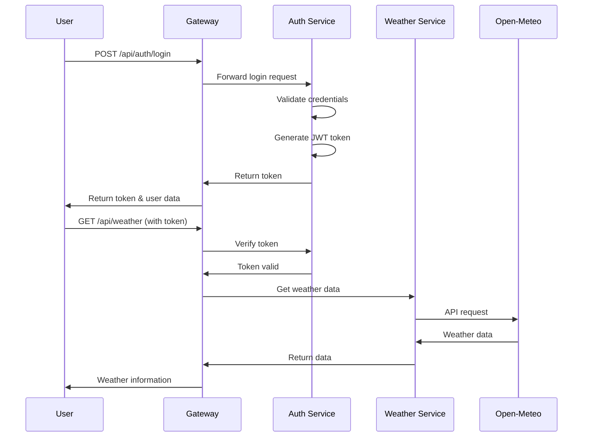

# 🌤️ Weather Dashboard - Microservices Architecture

A modern, full-stack weather application built with **Flask microservices**, featuring JWT authentication, real-time weather data, and a beautiful animated UI.


## 📸 Screenshots

### Landing Page


### Weather Dashboard


###  Demo

## 🏗️ Architecture Overview

This project implements a **microservices architecture** with three independent services:

```
┌─────────────────┐
│  Web Browser    │
│  (React/JS)     │
└────────┬────────┘
         │
         ↓
┌─────────────────────────┐
│   API Gateway           │
│   Port: 5000            │
│   - Request Routing     │
│   - Authentication      │
│   - Rate Limiting       │
└──────────┬──────────────┘
           │
    ┌──────┴──────┐
    ↓             ↓
┌─────────┐   ┌──────────────┐
│  Auth   │   │   Weather    │
│ Service │   │   Service    │
│ :5001   │   │   :5002      │
└─────────┘   └──────────────┘
```

## ✨ Features

### 🔐 Authentication Service
- User registration and login
- JWT token generation and validation
- Secure password hashing (bcrypt)
- Token blacklist for logout
- Session management

### 🌍 Weather Service
- Real-time weather data via Open-Meteo API
- Current weather conditions
- 6-hour hourly forecast
- 6-day daily forecast
- UV index, humidity, wind speed
- Geocoding for city search

### 🚪 API Gateway
- Single entry point for all requests
- JWT token verification
- Request routing to microservices
- Rate limiting
- Health check monitoring
- CORS handling

### 🎨 Frontend
- Animated landing page with floating weather icons
- Real-time weather visualization
- Dynamic background videos based on weather
- Responsive design (mobile & desktop)
- Beautiful gradient UI
- Smooth transitions and animations

## 🚀 Getting Started

### Prerequisites
- Python 3.8 or higher
- pip (Python package manager)
- Git

### Installation

1. **Clone the repository**
```bash
git clone https://github.com/yourusername/weather-dashboard.git
cd weather-dashboard
```

2. **Install dependencies**
```bash
pip install -r requirements.txt
```

3. **Download weather background videos**

Place these videos in `static/videos/`:
- `clear.mp4` - Clear/sunny weather
- `clouds.mp4` - Cloudy conditions
- `rain.mp4` - Rainy weather
- `thunderstorm.mp4` - Thunderstorms
- `snow.mp4` - Snowy weather
- `mist.mp4` - Foggy/misty conditions

**Video Sources:**
- [Pexels](https://www.pexels.com/videos/)
- [Pixabay](https://pixabay.com/videos/)
- [Coverr](https://coverr.co/)

4. **Add your profile image**
```bash
# Place your profile photo as static/profile.jpg
```

### Running the Application

You need to run **3 separate services** in different terminals:

**Terminal 1 - Auth Service:**
```bash
python auth_service.py
```
Output: `🔐 AUTH SERVICE STARTED - Running on: http://localhost:5001`

**Terminal 2 - Weather Service:**
```bash
python weather_service.py
```
Output: `🌤️ WEATHER SERVICE STARTED - Running on: http://localhost:5002`

**Terminal 3 - API Gateway:**
```bash
python app.py
```
Output: `🚪 API GATEWAY STARTED - Running on: http://localhost:5000`

**Access the application:**
```
http://localhost:5000
```

## 📁 Project Structure

```
weather-dashboard/
│
├── auth_service.py          # Authentication microservice
├── weather_service.py       # Weather data microservice
├── app.py                   # API Gateway
│
├── templates/
│   └── index.html          # Main HTML template
│
├── static/
│   ├── style.css           # Styles and animations
│   ├── script.js           # Frontend JavaScript
│   ├── profile.jpg         # Profile picture
│   └── videos/             # Weather background videos
│       ├── clear.mp4
│       ├── clouds.mp4
│       ├── rain.mp4
│       ├── thunderstorm.mp4
│       ├── snow.mp4
│       └── mist.mp4
│
├── requirements.txt         # Python dependencies
├── README.md               # This file
└── .gitignore              # Git ignore rules
```

## 🔧 Configuration

### Environment Variables

You can customize service URLs using environment variables:

```bash
export AUTH_SERVICE_URL=http://localhost:5001
export WEATHER_SERVICE_URL=http://localhost:5002
```

### Default Credentials

```
Email: admin@weather.com
Password: admin123
```

**⚠️ Important:** Change the secret key in `auth_service.py` for production:
```python
SECRET_KEY = 'your-secure-random-key-here'
```

## 🌐 API Documentation

### Authentication Endpoints

#### Register User
```http
POST /api/auth/register
Content-Type: application/json

{
  "email": "user@example.com",
  "password": "password123",
  "name": "John Doe"
}

Response: 201 Created
{
  "message": "User registered",
  "email": "user@example.com"
}
```

#### Login
```http
POST /api/auth/login
Content-Type: application/json

{
  "email": "user@example.com",
  "password": "password123"
}

Response: 200 OK
{
  "token": "eyJhbGciOiJIUzI1NiIsInR5cCI6IkpXVCJ9...",
  "user": {
    "email": "user@example.com",
    "name": "John Doe"
  }
}
```

#### Verify Token
```http
GET /api/auth/verify
Authorization: Bearer <token>

Response: 200 OK
{
  "valid": true,
  "email": "user@example.com"
}
```

### Weather Endpoints

#### Get Current Weather
```http
GET /api/weather?city=London
Authorization: Bearer <token>

Response: 200 OK
{
  "city": "London",
  "country": "GB",
  "temp": 15,
  "feels_like": 13,
  "description": "Clouds",
  "humidity": 72,
  "wind_speed": 8,
  "hourly": [...],
  "daily": [...]
}
```

## 🔄 How It Works

### Request Flow

1. **User makes request** → Browser sends to API Gateway (`:5000`)
2. **Gateway authenticates** → Verifies JWT token with Auth Service (`:5001`)
3. **Gateway routes** → Forwards request to Weather Service (`:5002`)
4. **Service processes** → Fetches data from Open-Meteo API
5. **Response returns** → Gateway → Browser

### Authentication Flow



### Data Storage

#### In-Memory Storage (Current Implementation)
- **Users:** Stored in Python dictionary
- **Tokens:** JWT (stateless)
- **Session:** localStorage (browser)

#### For Production
Consider using:
- **PostgreSQL/MySQL** for user data
- **Redis** for token blacklist
- **MongoDB** for weather cache

## 🛡️ Security Features

- ✅ JWT token-based authentication
- ✅ Password hashing with bcrypt
- ✅ CORS protection
- ✅ Token expiration (24 hours)
- ✅ Secure headers
- ✅ Input validation
- ✅ Rate limiting (implemented)

## 🎨 Frontend Technologies

- **HTML5** - Structure
- **CSS3** - Styling and animations
- **JavaScript (ES6+)** - Logic and API calls
- **Fetch API** - HTTP requests
- **LocalStorage** - Token persistence

## 📊 Technologies Used

### Backend
- **Flask** - Web framework
- **Flask-CORS** - Cross-origin resource sharing
- **PyJWT** - JSON Web Tokens
- **Werkzeug** - Password hashing
- **Requests** - HTTP client

### Frontend
- **Vanilla JavaScript** - No frameworks
- **CSS Animations** - Smooth transitions
- **HTML5 Video** - Dynamic backgrounds

### External APIs
- **Open-Meteo API** - Weather data (FREE, no API key needed!)

## 🧪 Testing

### Test Individual Services

```bash
# Test Auth Service
curl http://localhost:5001/health

# Test Weather Service  
curl http://localhost:5002/health

# Test Gateway
curl http://localhost:5000/health
```

### Test Full Flow

```bash
# Register
curl -X POST http://localhost:5000/api/auth/register \
  -H "Content-Type: application/json" \
  -d '{"email":"test@test.com","password":"test123","name":"Test User"}'

# Login
curl -X POST http://localhost:5000/api/auth/login \
  -H "Content-Type: application/json" \
  -d '{"email":"admin@weather.com","password":"admin123"}'

# Get Weather (replace TOKEN)
curl http://localhost:5000/api/weather?city=London \
  -H "Authorization: Bearer TOKEN"
```

## 🚀 Deployment

### Docker (Optional)

Create `Dockerfile` for each service and use `docker-compose.yml` to orchestrate.

### Cloud Deployment

Suitable for:
- **Heroku** - Free tier available
- **AWS EC2** - Scalable
- **Google Cloud Run** - Serverless
- **DigitalOcean** - Simple VPS

**Environment Setup:**
```bash
# Set production secret key
export SECRET_KEY="your-production-secret-key"

# Set service URLs
export AUTH_SERVICE_URL="https://auth.yourdomain.com"
export WEATHER_SERVICE_URL="https://weather.yourdomain.com"
```

## 🤝 Contributing

Contributions are welcome! Please follow these steps:

1. Fork the repository
2. Create a feature branch (`git checkout -b feature/AmazingFeature`)
3. Commit your changes (`git commit -m 'Add some AmazingFeature'`)
4. Push to the branch (`git push origin feature/AmazingFeature`)
5. Open a Pull Request

## 📝 License

This project is licensed under the MIT License - see the [LICENSE](LICENSE) file for details.

## 👤 Author

**Atharva Jadhav**

- GitHub: [@AtharvaJadhav](https://github.com/yourusername)
- LinkedIn: [Atharva Jadhav](https://linkedin.com/in/yourprofile)

## 🙏 Acknowledgments

- [Open-Meteo](https://open-meteo.com/) - Free weather API
- [Flask](https://flask.palletsprojects.com/) - Microframework
- [Pexels](https://www.pexels.com/) - Free stock videos
- Community contributors

## 📧 Support

For support, email support@example.com or open an issue on GitHub.

---

⭐ If you like this project, please give it a star on GitHub! ⭐
